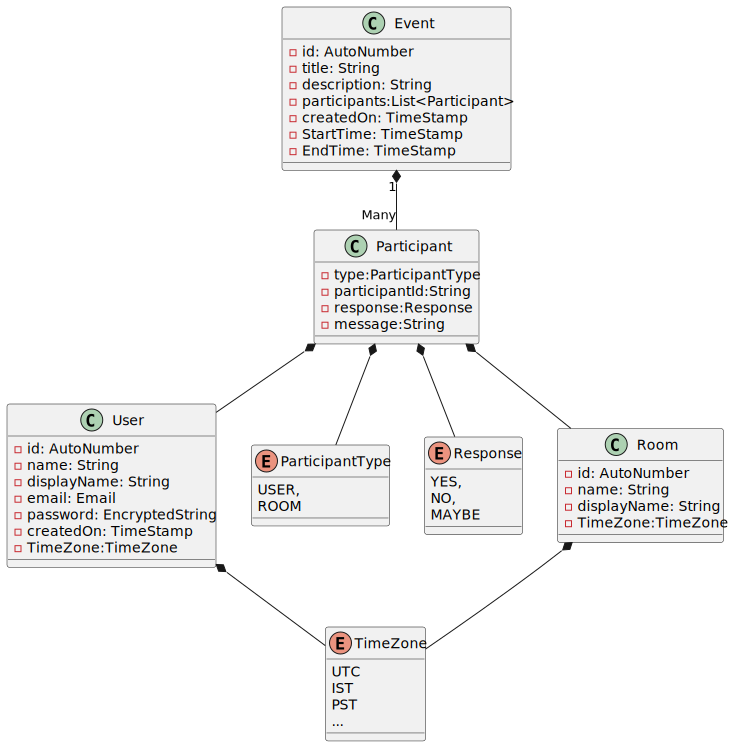
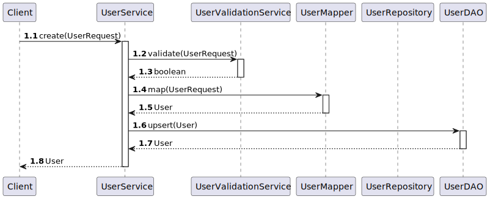
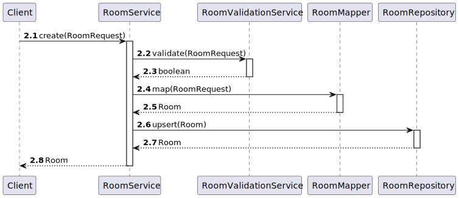
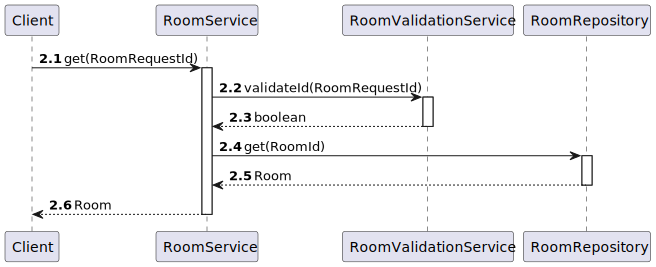
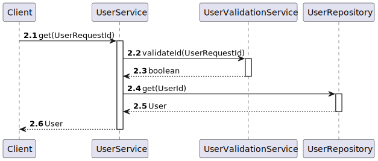
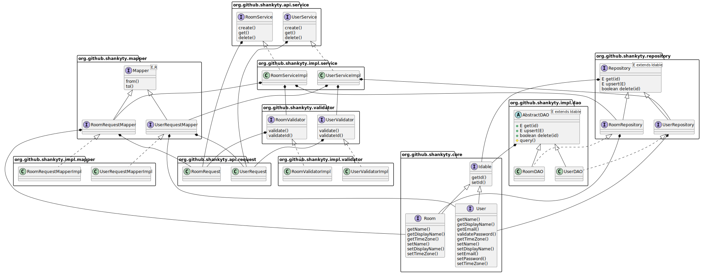

# Calendar

## Requirement
- Create a user
- Create a room
- View a room
- View user info
- Create an event with multiple users and rooms
- User can respond to event 

## Entities 

## Create a user

## Create a room

## View a room

## View a user

## Packages and classes
